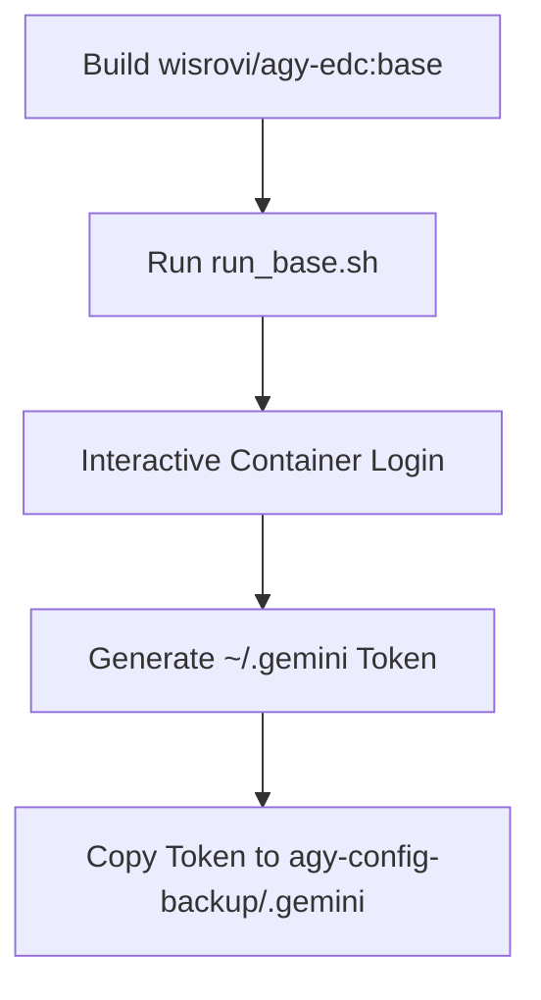

# 01_base

This component builds the base image containing the Google Antigravity (`agy`) CLI binary and handles the initial interactive login to generate the OAuth token.

## Technologies & Key Libraries
- **Ubuntu 24.04** - Base operating system.
- **Google Antigravity (`agy`)** - The AI agentic CLI tool.
- **Docker CLI (`docker.io`)** - Allows Docker execution commands.
- **Bash & Make** - Scripts to automate building and the interactive login process.

## Flow & Architecture
The folder contains `run_base.sh` which runs the base image interactively, mounts a local directory to capture the generated OAuth token under `~/.gemini`, and copies the authentication files into a local folder `agy-config-backup` so they can be embedded in subsequent client images.



## How to use
Run:
```bash
make all
```
This builds the base image, opens the interactive login interface for `agy`, and copies the authenticated token folder back to the host filesystem.
