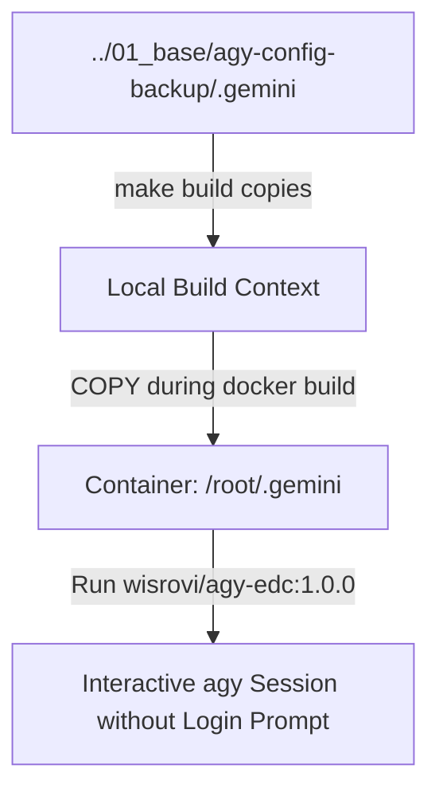

# 02_client

This component builds a second Docker image that embeds the pre-authenticated `.gemini` folder generated in `01_base` so that the CLI starts without prompting for login.

## Technologies & Key Libraries
- **wisrovi/agy-edc:base** - The base image containing the `agy` tool.
- **Docker** - Builds and runs the pre-authenticated client.
- **Make** - Orchestrates the copying of configuration and builds.

## Flow & Architecture
The build context imports the token backup folder and copies it directly into `/root/.gemini` during build time, locking down the ownership to `root:root`.



## How to use
Run:
```bash
make all
```
This copies the credential folder from the base component directory, builds the client image, and runs it.
