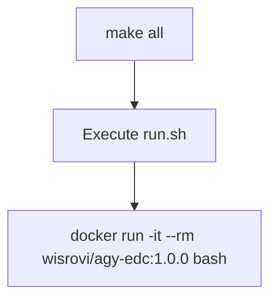

# 03_use

This component provides a simplified wrapper script and Makefile to execute the pre-authenticated client image directly.

## Technologies & Key Libraries
- **Docker** - Platform used to launch the final client container.
- **Bash & Make** - Scripts to automate executing the container.

## Flow & Architecture
Runs the docker client image directly in an interactive bash session:



## How to use
Run:
```bash
make all
```
This launches a bash session inside the pre-authenticated container.
