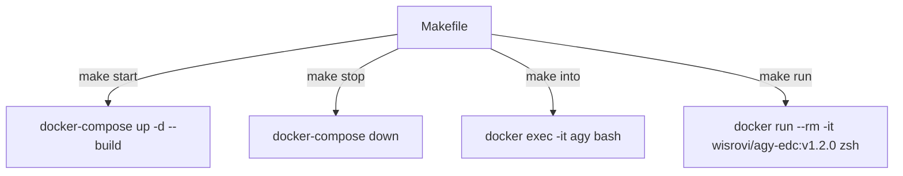

# 04_advance

This component builds an advanced image containing the Google Antigravity (`agy`) CLI binary, shell customization (`zsh` with Oh My Zsh and custom prompt), and defines various execution targets.

## Technologies & Key Libraries
- **wisrovi/agy-edc:base** (or tag `v1.1.0`) - Inherited base containing `agy` tool.
- **Ubuntu 24.04** - Underlying OS environment.
- **Zsh & Oh My Zsh** - Custom shell using `zsh-in-docker` and the `aussiegeek` theme.
- **figlet** - Used to display customized text greetings inside the shell rc scripts.
- **Docker Compose** - Orchestration tool to run persistent containers.

## Flow & Architecture
This folder contains targets for building and running containers in either daemon mode (via Docker Compose) or interactive auto-removal mode (via `docker run --rm`):



## How to use
- To build and start via Docker Compose:
  ```bash
  make start
  ```
- To enter the daemon container:
  ```bash
  make into
  ```
- To run an ephemeral interactive session that cleans itself up on exit:
  ```bash
  make run
  ```
- To stop the daemon container:
  ```bash
  make stop
  ```
