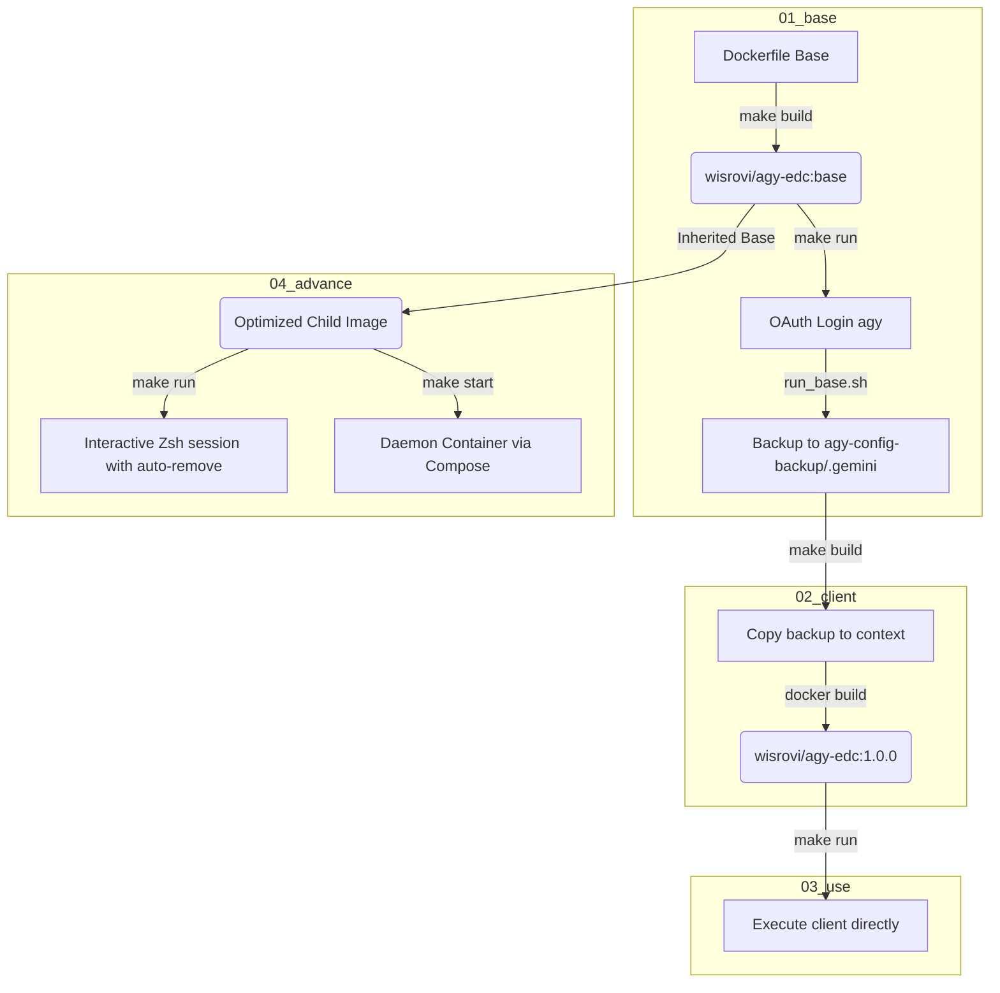

# agy‑edc project

## Overview
This repository contains a Docker‑based workflow to use **Google Antigravity (agy)** without needing to re‑authenticate on every container run.

The project is organized into four main stages/folders:

- `01_base` – Builds a base image that installs the `agy` binary and is used to perform the initial OAuth login.
- `02_client` – Builds a second image that copies the authentication configuration (`$HOME/.gemini`) from the host, so `agy` starts without prompting for login.
- `03_use` – Provides a simple script to run the final image (`wisrovi/agy-edc:1.0.0`).
- `04_advance` – Builds an optimized advanced image with Zsh, Oh My Zsh (aussiegeek theme), figlet customizations, and Docker Compose configurations.

## Architecture Flow
Here is the global workflow of the project, showing how authentication data is generated, backed up, embedded, and used across the components:



## Technologies & Key Libraries
- **Ubuntu 24.04** – Base operating system.
- **Google Antigravity (agy)** – CLI tool for agentic workflows.
- **Zsh & Oh My Zsh** – Customized shell interface (aussiegeek theme).
- **figlet** – Terminal ascii-art banner generator.
- **Docker & Docker Compose** – Containerization and orchestration.
- **Bash & Make** – Scripting and build automation.

## Quick start
```bash
# 1️⃣ Build and authenticate with the base image
cd 01_base
make all   # builds the base image and opens an interactive agy session to login

# 2️⃣ Build the client image that re‑uses the stored token
cd ../02_client
make all   # copies the .gemini config and builds the pre-authenticated image

# 3️⃣ Run the client image
cd ../03_use
make all   # runs the pre-authenticated image

# 4️⃣ Run the advanced interactive shell environment
cd ../04_advance
make run   # starts interactive Zsh console and auto-removes on exit
```

---
*Author: WILLIAM R.*, AI Leader & Solutions Architect
