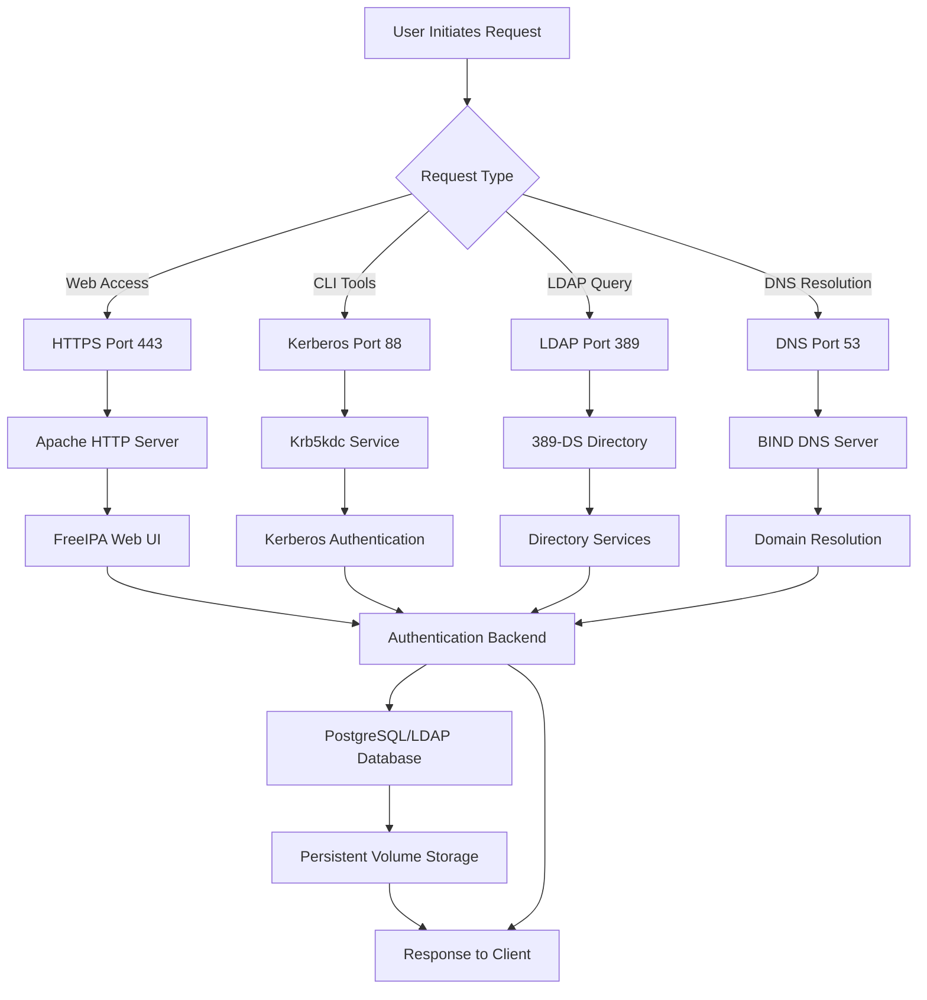
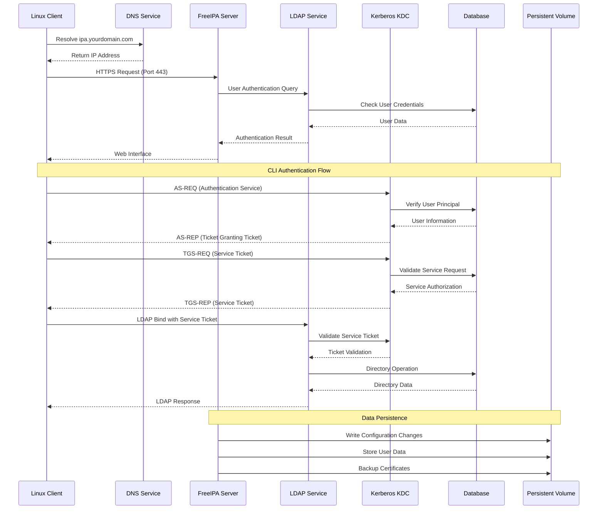
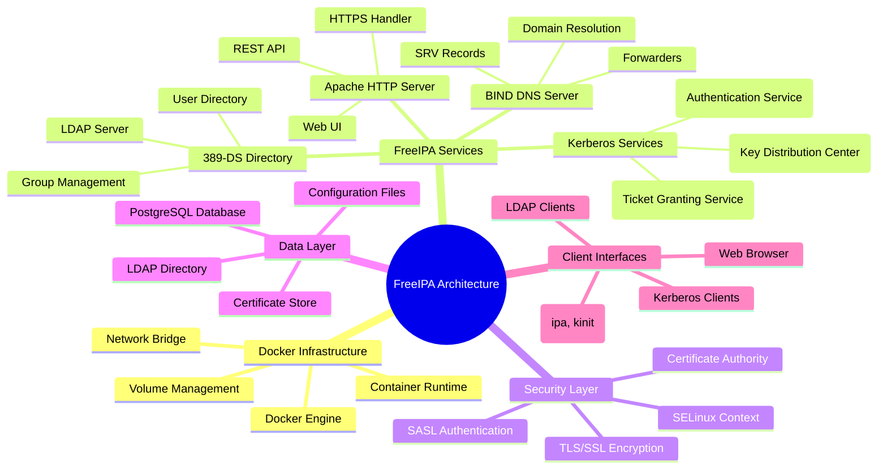

# FreeIPA Docker Deployment


## Project Overview

This project provides a comprehensive Docker-based deployment solution for FreeIPA (Identity, Policy, and Audit), an open-source identity management system. FreeIPA provides centralized authentication, authorization, and account information for Linux/Unix networks.

The deployment includes automated installation scripts, configuration templates, and detailed documentation for setting up both FreeIPA server and clients in containerized environments.

## 🚶 Diagram Walkthrough (Main Process Flow)



## 🗺️ System Workflow (Detailed Event Sequence)



## 🏗️ Architecture Components



## ⚙️ Container Lifecycle

### Build Process

1. **Base Image Selection**: Uses `freeipa/freeipa-server:rocky-9` as foundation
2. **Volume Preparation**: Creates `freeipa-data` volume for persistent storage
3. **Network Configuration**: Sets up port mappings for all required services
4. **Security Context**: Applies SELinux labeling with `:Z` flag
5. **Environment Setup**: Configures hostname, domain, and realm parameters
6. **Service Configuration**: Prepares unattended installation parameters

### Runtime Process

1. **Container Initialization**: Docker starts the FreeIPA container
2. **System Bootstrap**: Initializes Rocky Linux base system
3. **FreeIPA Installation**: Runs `ipa-server-install --unattended` with pre-configured parameters
4. **Service Startup**: Sequentially starts all FreeIPA services:
   - Directory Server (389-DS)
   - Kerberos KDC
   - Apache HTTP Server
   - BIND DNS Server
5. **Database Initialization**: Creates and populates LDAP directory structure
6. **Certificate Generation**: Generates CA certificates and server certificates
7. **Service Registration**: Registers all services with the system
8. **Health Checks**: Performs initial service health validation
9. **Ready State**: Container becomes ready to accept client connections

## 📂 File-by-File Guide

| File/Folder | Purpose |
|-------------|---------|
| `README.md` | Comprehensive project documentation and usage guide |
| `install.sh` | Automated Docker deployment script with pre-configured parameters |
| `hostname` | Contains the FQDN configuration for the FreeIPA server |
| `build-id` | Unique identifier for tracking specific deployment instances |
| `Instalacion_FreeIPA.txt` | Detailed Spanish installation guide with troubleshooting steps |

## Features

- **Automated Docker Deployment**: One-command FreeIPA server setup
- **Container-based Architecture**: Isolated and portable deployment
- **DNS Integration**: Built-in DNS server configuration
- **Security Hardening**: TLS/SSL encryption for all services
- **Client Management**: Automated client enrollment scripts
- **Multi-protocol Support**: LDAP, Kerberos, HTTP/HTTPS, DNS services
- **Persistent Data**: Docker volume management for data persistence
- **Production Ready**: Configured for enterprise environments

## Getting Started

### Prerequisites

- Docker installed and running
- System with at least 2GB RAM
- Root or sudo privileges
- Properly configured FQDN (Fully Qualified Domain Name)

### Quick Installation

1. **Clone or download this project**
2. **Configure your environment variables** in `install.sh`:
   - Update hostname, domain, realm, and passwords
3. **Run the installation script**:
   ```bash
   chmod +x install.sh
   ./install.sh
   ```

### Manual Installation

1. **Pull the FreeIPA Docker image**:
   ```bash
   docker pull freeipa/freeipa-server:rocky-9
   ```

2. **Create persistent volume**:
   ```bash
   docker volume create freeipa-data
   ```

3. **Run the container** (modify parameters as needed):
   ```bash
   docker run -d --name freeipa-server-container \
     -h ipa.yourdomain.com \
     -v freeipa-data:/data:Z \
     -p 80:80 -p 443:443 -p 389:389 -p 636:636 \
     -p 88:88 -p 88:88/udp -p 464:464 -p 464:464/udp \
     -p 53:53 -p 53:53/udp \
     freeipa/freeipa-server:rocky-9 \
     ipa-server-install --unattended \
       --realm=YOURDOMAIN.COM \
       --domain=yourdomain.com \
       --ds-password=YourSecurePassword \
       --admin-password=YourSecurePassword \
       --setup-dns --auto-forwarders --no-ntp
   ```

## File Structure

```
/app/
├── README.md                    # This documentation file
├── install.sh                   # Automated installation script
├── hostname                     # Server hostname configuration
├── build-id                     # Unique build identifier
└── Instalacion_FreeIPA.txt      # Detailed installation guide (Spanish)
```

### Key Files Description

- **install.sh**: Pre-configured Docker run command for quick deployment
- **hostname**: Contains the FQDN for the FreeIPA server
- **build-id**: Unique identifier for this deployment instance
- **Instalacion_FreeIPA.txt**: Comprehensive installation and troubleshooting guide

## Configuration

### Required Configuration Parameters

Before deployment, update these parameters in `install.sh`:

| Parameter | Description | Example |
|-----------|-------------|---------|
| `hostname` | FQDN of the FreeIPA server | `ipa.yourdomain.com` |
| `realm` | Kerberos realm (uppercase) | `YOURDOMAIN.COM` |
| `domain` | DNS domain | `yourdomain.com` |
| `ds-password` | Directory Manager password | `SecurePass123!` |
| `admin-password` | Admin user password | `AdminPass123!` |

### Environment Variables

The system uses the following environment-specific configurations:

- **Network Ports**: HTTP (80), HTTPS (443), LDAP (389), LDAPS (636), Kerberos (88/UDP), Kpasswd (464/UDP), DNS (53/UDP)
- **Volume Mount**: `/data` for persistent storage
- **Security Context**: SELinux context (`:Z`) for proper permissions

## Usage Examples

### Accessing FreeIPA Web Interface

After successful installation, access the web interface at:
```
https://ipa.yourdomain.com
```

Login with:
- **Username**: `admin`
- **Password**: Your configured admin password

### Client Enrollment

To enroll a Linux client:

1. **Install client packages**:
   ```bash
   sudo apt update
   sudo apt install -y freeipa-client sssd chrony curl
   ```

2. **Configure hosts file**:
   ```bash
   echo "192.168.1.100 ipa.yourdomain.com" | sudo tee -a /etc/hosts
   ```

3. **Download CA certificate**:
   ```bash
   sudo mkdir -p /etc/ipa
   curl -o ca.crt http://ipa.yourdomain.com/ipa/config/ca.crt
   sudo mv ca.crt /etc/ipa/ca.crt
   ```

4. **Enroll client**:
   ```bash
   sudo ipa-client-install \
     --hostname=$(hostname -f) \
     --realm=YOURDOMAIN.COM \
     --domain=yourdomain.com \
     --server=ipa.yourdomain.com \
     --mkhomedir \
     --principal=admin \
     --ca-cert-file=/etc/ipa/ca.crt
   ```

### User Management Examples

```bash
# Add a new user
ipa user-add jsmith --first=John --last=Smith --email=jsmith@yourdomain.com

# Add user to group
ipa group-add developers --desc="Development Team"
ipa group-add-member developers --users=jsmith

# Create service principal
ipa service-add HTTP/webapp.yourdomain.com
```

## System Workflow Diagram

```
┌─────────────────┐    ┌──────────────────┐    ┌─────────────────┐
│   Client        │    │   FreeIPA Server │    │   Docker Host   │
│                 │    │                  │    │                 │
│ ┌─────────────┐ │    │ ┌──────────────┐ │    │ ┌─────────────┐ │
│ │ LDAP Client │◄┼────┼►│   LDAP/389   │ │    │ │ Docker Engine│ │
│ └─────────────┘ │    │ └──────────────┘ │    │ └─────────────┘ │
│                 │    │                  │    │                 │
│ ┌─────────────┐ │    │ ┌──────────────┐ │    │ ┌─────────────┐ │
│ │Kerberos CLI│◄┼────┼►│  Kerberos/88 │ │    │ │ Volume Store │ │
│ └─────────────┘ │    │ └──────────────┘ │    │ │freeipa-data  │ │
│                 │    │                  │    │ └─────────────┘ │
│ ┌─────────────┐ │    │ ┌──────────────┐ │    │                 │
│ │Web Browser  │◄┼────┼►│  HTTPS/443   │ │    │ ┌─────────────┐ │
│ └─────────────┘ │    │ └──────────────┘ │    │ │ Port Mapping│ │
└─────────────────┘    └──────────────────┘    │ │80,443,389...│ │
                                               │ └─────────────┘ │
                                               └─────────────────┘
```

## Diagram Walkthrough

### Authentication Flow

1. **Initial Request**: Client attempts to access a resource
2. **Service Discovery**: Client locates FreeIPA server via DNS
3. **Authentication**: 
   - Web interface uses HTTPS (port 443)
   - CLI tools use Kerberos (port 88) or LDAP (port 389)
4. **Authorization**: FreeIPA checks user permissions and group memberships
5. **Resource Access**: Client receives authentication token or denial

### Container Architecture

1. **Docker Engine**: Manages container lifecycle and resource allocation
2. **FreeIPA Container**: Runs all FreeIPA services in isolated environment
3. **Persistent Volume**: Stores configuration, user data, and certificates
4. **Port Mapping**: Exposes services to host network for client access
5. **Security Context**: SELinux labeling ensures proper file permissions

### Data Flow

1. **User Creation**: Admin creates users via web interface or CLI
2. **Group Management**: Users are organized into functional groups
3. **Policy Application**: Access controls and policies are enforced
4. **Client Enrollment**: Systems join the domain for centralized management
5. **Authentication Events**: All auth attempts are logged and audited

## Troubleshooting

### Common Issues and Solutions

#### 1. Cgroup Error
```
Failed to create /init.scope control group: Read-only file system
```
**Solution**: Add to `/etc/docker/daemon.json`:
```json
{
  "userns-remap": "default"
}
```
Then restart Docker: `sudo systemctl restart docker`

#### 2. Port 53 Conflict
```
Failed to set up container networking
```
**Solution**: Stop conflicting service:
```bash
sudo systemctl stop systemd-resolved
```

#### 3. DNS Resolution Issues
**Solution**: Ensure proper `/etc/hosts` configuration:
```bash
echo "YOUR_SERVER_IP ipa.yourdomain.com" | sudo tee -a /etc/hosts
```

### Health Checks

Monitor container status:
```bash
docker ps | grep freeipa
docker logs freeipa-server-container
```

Test service availability:
```bash
# LDAP test
ldapsearch -x -H ldap://ipa.yourdomain.com -b "dc=yourdomain,dc=com"

# Kerberos test
kinit admin@YOURDOMAIN.COM
```

## Security Considerations

- **Password Security**: Use strong, unique passwords for Directory Manager and admin accounts
- **Network Security**: Deploy behind firewall, limit exposed ports
- **TLS Configuration**: Ensure proper certificate management
- **Regular Updates**: Keep Docker images and FreeIPA packages updated
- **Backup Strategy**: Regular backups of `/data` volume contents

## Author

**William Rodríguez - wisrovi**

LinkedIn: [https://es.linkedin.com/in/wisrovi-rodriguez](https://es.linkedin.com/in/wisrovi-rodriguez)

Identity Management and Linux Systems Specialist with expertise in FreeIPA deployment and enterprise authentication solutions.

## License

This project is provided as-is for educational and enterprise deployment purposes. FreeIPA is licensed under the GNU General Public License v3.0.

## Support

For additional support:
- FreeIPA Official Documentation: [https://www.freeipa.org/](https://www.freeipa.org/)
- FreeIPA GitHub Repository: [https://github.com/freeipa/freeipa-container](https://github.com/freeipa/freeipa-container)
- Community Forums: [https://www.freeipa.org/page/Community](https://www.freeipa.org/page/Community)