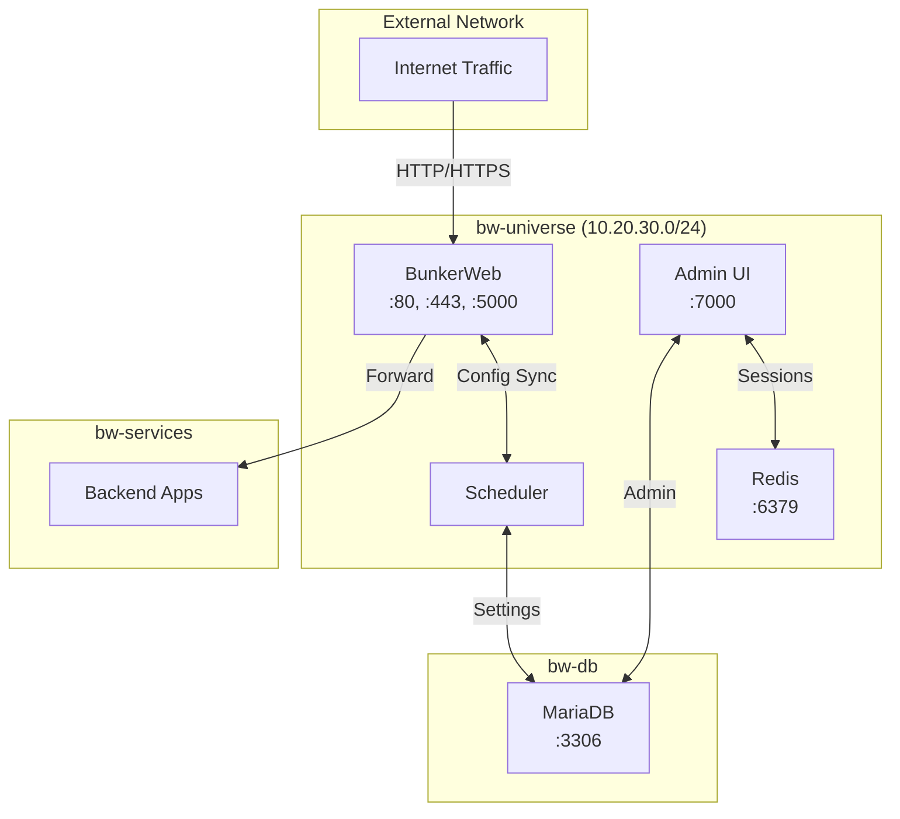
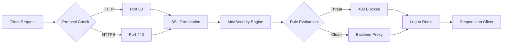
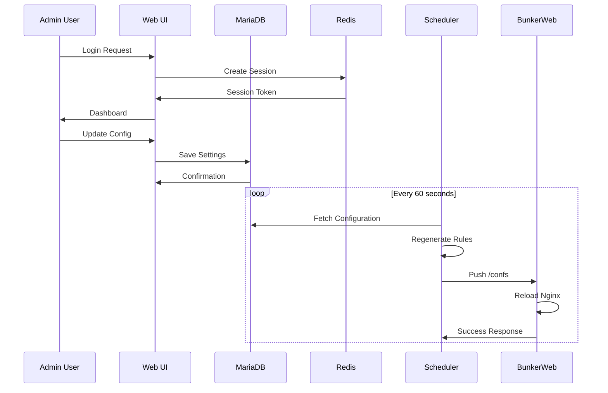

# Architecture & Backend Core

## 1. Vision Overview

This document describes the architecture of the BunkerWeb WAF (Web Application Firewall) deployment. BunkerWeb is an open-source security solution built on Nginx that provides real-time protection against web-based attacks including SQL injection, cross-site scripting (XSS), DDoS attempts, and other OWASP Top 10 vulnerabilities.

## 2. Architectural Principles

### 2.1 Defense in Depth
The deployment implements multiple layers of security:
- **Network Layer**: Isolated Docker networks (bw-universe, bw-services, bw-db)
- **Application Layer**: ModSecurity rules engine for HTTP traffic inspection
- **Data Layer**: Encrypted communication between components via TLS
- **Presentation Layer**: Role-based access control for the administration UI

### 2.2 High Availability
- Health checks integrated at every service level
- Automated recovery through Docker's health monitoring
- Redis session backend for stateless UI scaling
- Scheduler-based configuration synchronization

### 2.3 Modularity
- Plugin-based architecture for custom security policies
- Separate concerns: WAF engine, scheduler, UI, database, cache
- Extensible blacklist management system

## 3. Backend Core Components

### 3.1 BunkerWeb Core Engine (bunkerweb)
- **Technology**: Nginx + ModSecurity + Python
- **Port**: 80 (HTTP), 443 (HTTPS/QUIC)
- **Function**: Primary WAF processing engine
- **API Port**: 5000 (internal)

The core engine operates as:
1. Reverse proxy handling incoming HTTP/HTTPS traffic
2. ModSecurity rules engine for request validation
3. API server for configuration and health endpoints
4. SSL/TLS termination point

### 3.2 Configuration Scheduler (bw-scheduler)
- **Technology**: Python-based automation
- **Function**: Background job executor for security updates
- **Network**: bw-universe, bw-db

Scheduler responsibilities:
- Periodic blacklist downloads from threat intelligence sources
- Configuration regeneration and push to WAF engine
- Database backup management
- Plugin job execution

### 3.3 Administration UI (bw-ui)
- **Technology**: Flask + Gunicorn
- **Port**: 7000 (exposed)
- **Function**: Web-based management interface

UI features:
- Dashboard with security analytics
- Configuration management interface
- User authentication and session management
- Real-time monitoring display

### 3.4 Data Layer
- **MariaDB (bw-db)**: Port 3306 - Persistent configuration storage
- **Redis (redis)**: Port 6379 - Session and cache management

## 4. Technology Stack Summary

| Component | Technology | Role |
|-----------|------------|------|
| WAF Core | BunkerWeb 1.6.9 | Traffic filtering & proxy |
| Web Server | Nginx | Reverse proxy & SSL termination |
| Rules Engine | ModSecurity | Request validation |
| API Layer | Python Flask | Internal API endpoints |
| Scheduler | Python | Background automation |
| UI | Flask + Gunicorn | Administration interface |
| Database | MariaDB 11 | Configuration persistence |
| Cache | Redis 8-alpine | Session & data caching |
| Container | Docker Compose v2 | Orchestration |

## 5. Deployment Topology

## 6. Data Flow Architecture

### 6.1 Request Processing Pipeline

### 6.2 Configuration Management Flow

## 7. Key Design Decisions

### 7.1 API Whitelist Strategy
- Internal API restricted to `127.0.0.0/8` and `10.20.30.0/24`
- Scheduler communicates via internal network only
- External access blocked at WAF level

### 7.2 Database Configuration
- MariaDB chosen for ACID compliance
- Configuration stored persistently across restarts
- Separate network for database isolation

### 7.3 Session Management
- Redis backend for distributed session handling
- Cookie-based authentication for UI
- Session data encrypted at rest

### 7.4 Logging Architecture
- All logs streamed to Docker logging driver
- Structured logging for security events
- Integration point for external log aggregation

## 8. Scalability Considerations

The architecture supports horizontal scaling through:
- Stateless UI design with Redis sessions
- Database connection pooling
- Redis caching to reduce DB load
- Separate networks to prevent broadcast storms
