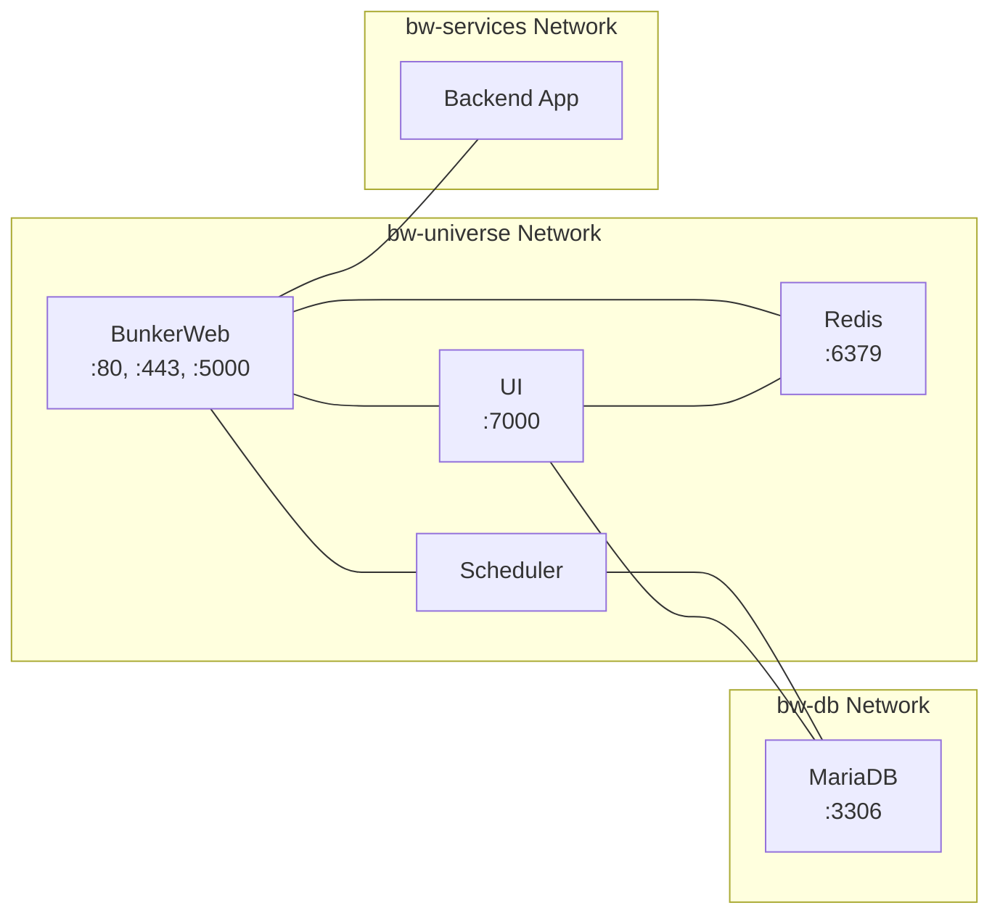
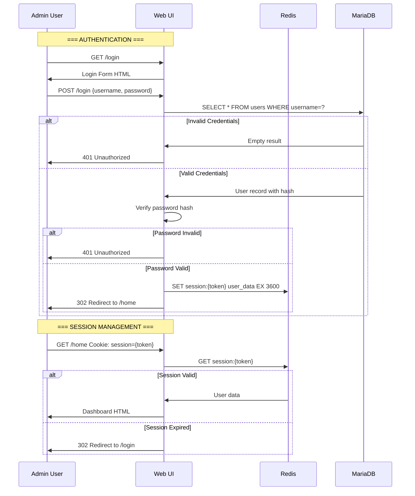
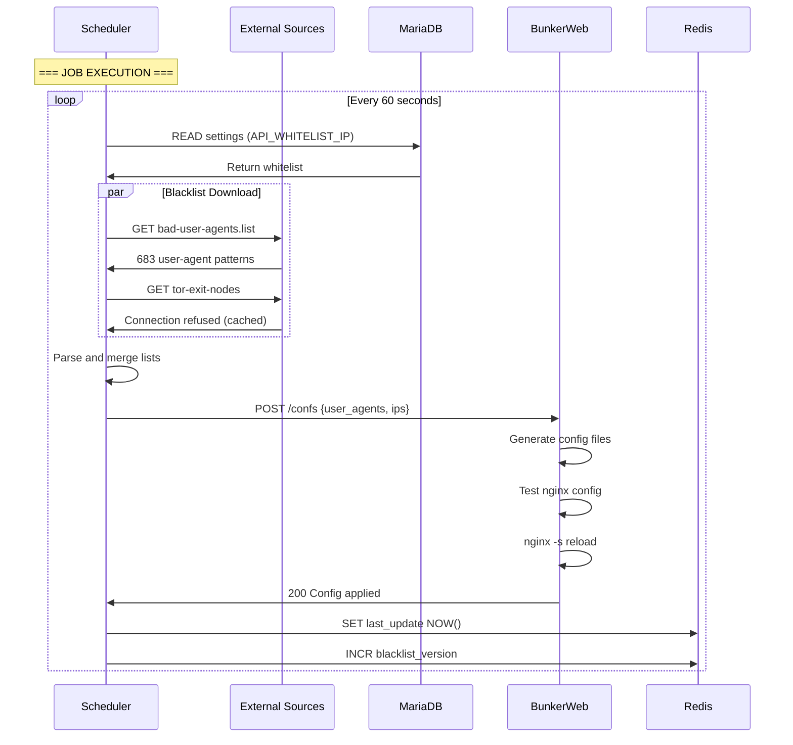
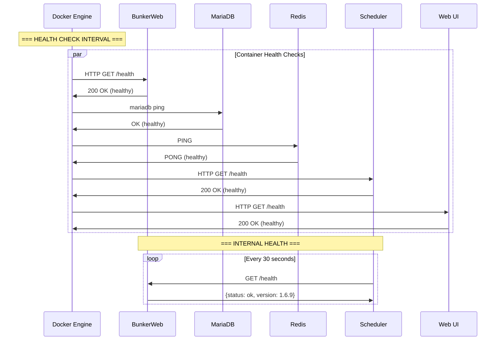

# Communication Flow

## 1. External Communication

### 1.1 Client-to-WAF Communication
BunkerWeb exposes two main endpoints for external traffic:

| Endpoint | Port | Protocol | Purpose |
|----------|------|----------|---------|
| HTTP | 80 | HTTP/1.1, HTTP/2, HTTP/3 | Standard traffic proxy |
| HTTPS | 443 | HTTPS with QUIC/HTTP3 | Secure traffic with modern protocols |

### 1.2 Administration Access
The web UI is accessible on port 7000:
- Session-based authentication
- Redirects to setup wizard on first access
- Dashboard available after initial configuration

### 1.3 Response Codes
- **200**: Request allowed and forwarded
- **403**: Threat detected and blocked
- **303**: Redirect (UI setup/login)

## 2. Internal Service Communication

### 2.1 Service-to-Service Ports

### 2.2 Communication Matrix

| Source | Destination | Port | Protocol | Purpose |
|--------|-------------|------|----------|---------|
| Client Browser | BunkerWeb | 80/443 | HTTP/HTTPS | Traffic proxy |
| Client Browser | Web UI | 7000 | HTTP | Administration |
| Scheduler | BunkerWeb API | 5000 | HTTP | Config push |
| Scheduler | MariaDB | 3306 | MySQL | Settings storage |
| Web UI | MariaDB | 3306 | MySQL | Config read/write |
| Web UI | Redis | 6379 | Redis | Session management |
| BunkerWeb | Redis | 6379 | Redis | Statistics |
| Scheduler | Redis | 6379 | Redis | Cache updates |

## 3. Detailed Communication Flows

### 3.1 Request Processing Flow

```mermaid
sequenceDiagram
    participant Client as External Client
    participant WAF as BunkerWeb
    participant ModSec as ModSecurity
    participant Redis as Redis Cache
    participant Backend as Backend App
    participant Scheduler as Scheduler
    participant DB as MariaDB

    Note over Client,WAF: === INGRESS PHASE ===
    Client->>WAF: GET /protected-resource HTTP/1.1
    WAF->>WAF: SSL Termination (if HTTPS)
    
    rect rgb(40, 40, 40)
        Note over WAF,ModSec: Security Inspection
        WAF->>ModSec: Pass request to rules engine
        alt Attack Signature Match
            ModSec->>WAF: Block (403)
            WAF->>Client: 403 Forbidden
            WAF->>Redis: INCR blocked_count
            WAF->>Redis: HSET blocked_ips timestamp
        else Clean Request
            ModSec->>WAF: Allow
        end
    end
    
    alt Request Allowed
        WAF->>Backend: Forward request
        Backend->>WAF: Response
        WAF->>Client: 200 OK
    end
    
    Note over Scheduler,DB: === SCHEDULER PHASE ===
    loop Every 60 seconds
        Scheduler->>DB: SELECT * FROM settings
        DB->>Scheduler: Configuration data
        Scheduler->>Scheduler: Process blacklist URLs
        Scheduler->>External: GET blacklists
        Scheduler->>Scheduler: Merge rules
        Scheduler->>WAF: POST /confs JSON
        WAF->>WAF: Generate nginx.conf
        WAF->>WAF: nginx -s reload
        WAF->>Scheduler: 200 OK
    end
```

### 3.2 Admin UI Authentication Flow

### 3.3 Scheduler Update Flow

### 3.4 Health Check Flow

## 4. API Endpoints Summary

### 4.1 Internal WAF API (Port 5000)

| Endpoint | Method | Access | Purpose |
|----------|--------|--------|---------|
| `/health` | GET | Whitelisted IPs | Health check |
| `/confs` | POST | Scheduler only | Push configuration |
| `/confs` | GET | Scheduler only | Get current config |
| `/reload` | POST | Scheduler only | Reload nginx |
| `/cache` | POST | Scheduler only | Update cache |

### 4.2 UI Endpoints (Port 7000)

| Endpoint | Method | Access | Purpose |
|----------|--------|--------|---------|
| `/` | GET | Public | Root redirect |
| `/setup` | GET | Public | Setup wizard |
| `/login` | GET | Public | Login form |
| `/login` | POST | Public | Authenticate |
| `/home` | GET | Authenticated | Dashboard |
| `/settings` | GET | Authenticated | Config page |
| `/logs` | GET | Authenticated | View logs |

## 5. Network Isolation Details

### 5.1 bw-universe Network
- **Subnet**: 10.20.30.0/24
- **Purpose**: Main inter-service communication
- **Connected**: bunkerweb, bw-scheduler, bw-ui, redis

### 5.2 bw-services Network
- **Type**: Bridge (auto-assigned)
- **Purpose**: Backend application connectivity
- **Connected**: bunkerweb, external apps

### 5.3 bw-db Network
- **Type**: Bridge (auto-assigned)
- **Purpose**: Database isolation
- **Connected**: bw-scheduler, bw-ui, bw-db
