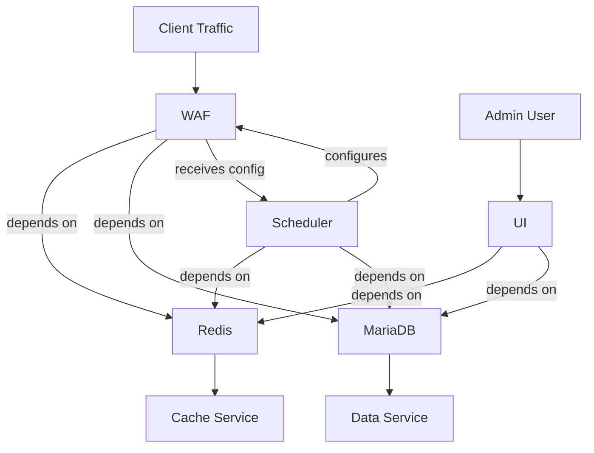
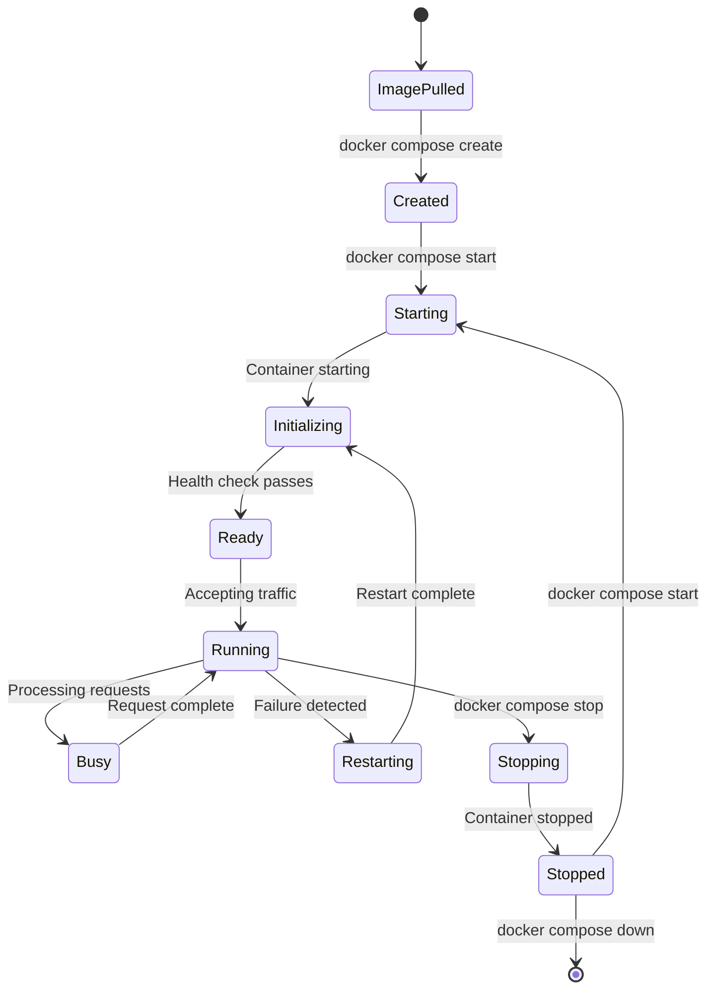

# Microservice Design

## 1. Service Architecture Overview

BunkerWeb is deployed as a multi-container microservices architecture using Docker Compose. Each service is containerized, independently scalable, and communicates through well-defined interfaces.

## 2. Service Specifications

### 2.1 bunkerweb (WAF Core)

```yaml
service: bunkerweb
image: bunkerity/bunkerweb:1.6.9
ports:
  - "80:8080/tcp"    # HTTP
  - "443:8443/tcp"   # HTTPS
  - "443:8443/udp"   # QUIC/HTTP3
networks:
  - bw-universe
  - bw-services
environment:
  - API_WHITELIST_IP
  - DATABASE_URI
  - USE_REDIS
  - REDIS_HOST
restart: unless-stopped
healthcheck:
  test: ["CMD", "wget", "-q", "--spider", "http://localhost:5000/health"]
  interval: 30s
  timeout: 10s
  retries: 3
```

**Internal Architecture:**
- Nginx worker processes (dynamic)
- ModSecurity rules engine
- Python API server (Flask)
- Configuration manager

### 2.2 bw-scheduler (Automation Engine)

```yaml
service: bw-scheduler
image: bunkerity/bunkerweb-scheduler:1.6.9
networks:
  - bw-universe
  - bw-db
environment:
  - BUNKERWEB_INSTANCES
  - SERVER_NAME
  - MULTISITE
  - UI_HOST
  - USE_REDIS
  - REDIS_HOST
volumes:
  - bw-storage:/data
restart: unless-stopped
```

**Responsibilities:**
- Cron-based job execution
- Blacklist download and processing
- Configuration generation
- Nginx config push to WAF

### 2.3 bw-ui (Administration Interface)

```yaml
service: bw-ui
image: bunkerity/bunkerweb-ui:1.6.9
ports:
  - "7000:7000/tcp"
networks:
  - bw-universe
  - bw-db
environment:
  - API_WHITELIST_IP
  - DATABASE_URI
restart: unless-stopped
```

**Architecture:**
- Flask application
- Gunicorn WSGI server (4 workers)
- Session management via Redis
- Template-based rendering

### 2.4 bw-db (Configuration Database)

```yaml
service: bw-db
image: mariadb:11
ports:
  - "3306:3306/tcp"
networks:
  - bw-db
environment:
  - MYSQL_RANDOM_ROOT_PASSWORD
  - MYSQL_DATABASE
  - MYSQL_USER
  - MYSQL_PASSWORD
volumes:
  - bw-data:/var/lib/mysql
command: --max-allowed-packet=67108864
restart: unless-stopped
```

### 2.5 redis (Cache & Sessions)

```yaml
service: redis
image: redis:8-alpine
ports:
  - "6379:6379/tcp"
networks:
  - bw-universe
command: >
  redis-server
  --maxmemory 256mb
  --maxmemory-policy allkeys-lru
  --save 60 1000
  --appendonly yes
volumes:
  - redis-data:/data
restart: unless-stopped
```

## 3. Service Dependency Graph



## 4. Service Lifecycle States



## 5. Inter-Service Communication Protocols

### 5.1 HTTP-based (REST API)
- WAF API: Internal JSON API on port 5000
- UI HTTP: Web interface on port 7000
- Health endpoints: `/health` on all services

### 5.2 Database Protocol
- MySQL/MariaDB wire protocol on port 3306
- Connection pooling managed by clients

### 5.3 Redis Protocol
- RESP (Redis Serialization Protocol) on port 6379
- Used for caching, sessions, and pub/sub

## 6. Resource Allocation

### 6.1 Memory Limits

| Service | Minimum | Recommended |
|---------|---------|-------------|
| bunkerweb | 256MB | 512MB |
| bw-scheduler | 128MB | 256MB |
| bw-ui | 256MB | 512MB |
| bw-db | 512MB | 1GB |
| redis | 64MB | 256MB |

### 6.2 CPU Allocation

| Service | Cores | Priority |
|---------|-------|----------|
| bunkerweb | 2 | High |
| bw-scheduler | 1 | Low |
| bw-ui | 1 | Medium |
| bw-db | 1 | Medium |
| redis | 1 | Low |

## 7. Configuration Management

### 7.1 Environment Variable Strategy
- Use YAML anchors for shared variables (`x-bw-env`)
- Environment-specific overrides in service definitions
- Secrets via environment (not recommended for production)

### 7.2 Volume Mounts
- `bw-data`: Database persistence
- `bw-storage`: Cache and backups
- `redis-data`: Redis persistence

### 7.3 Network Mode
- Custom bridge networks for isolation
- No host networking (security)
- Port exposure only where necessary
