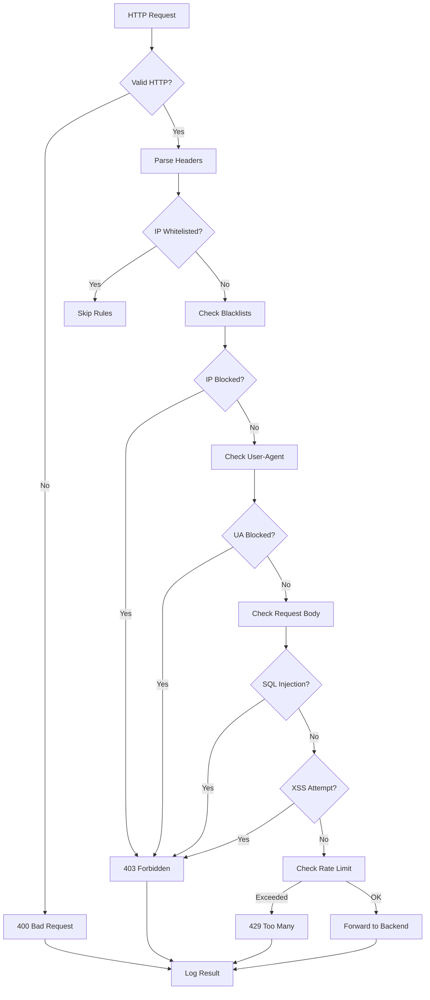
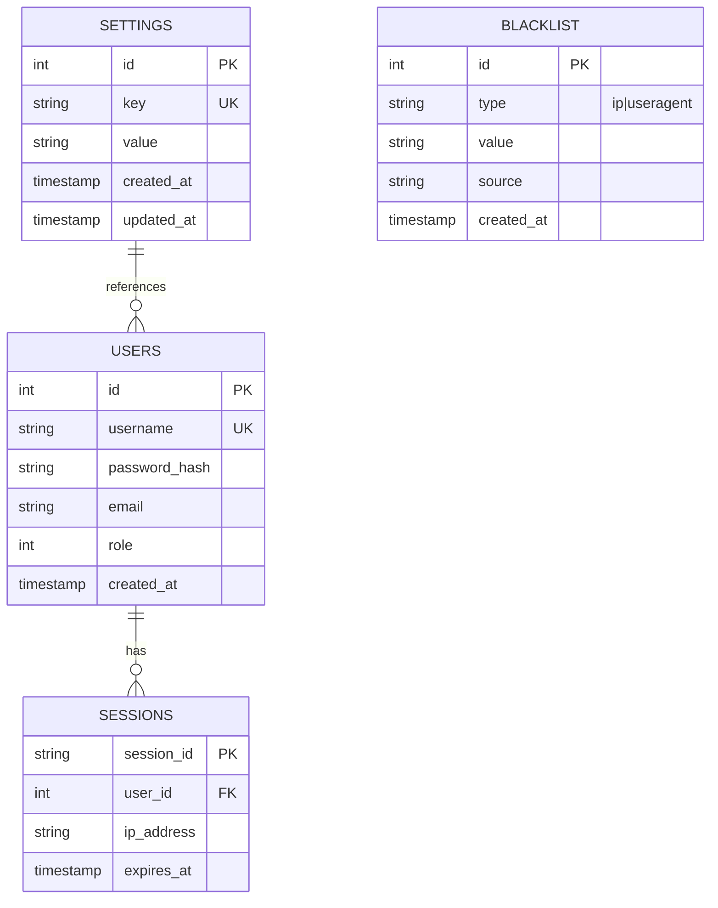
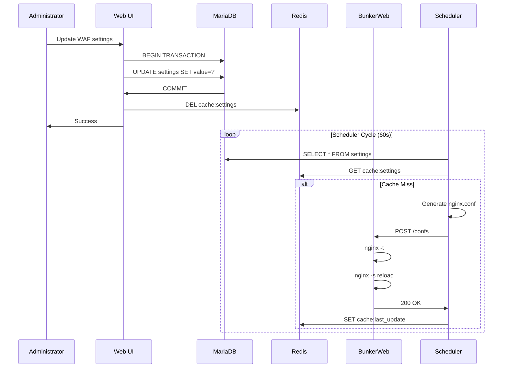
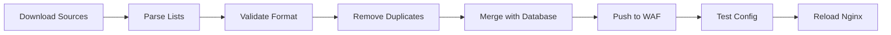
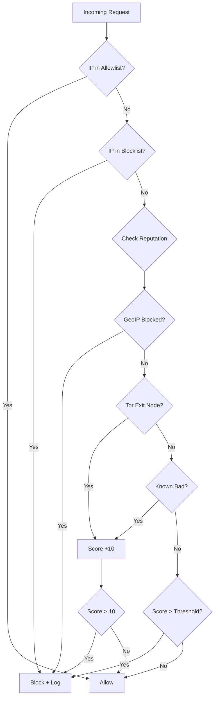
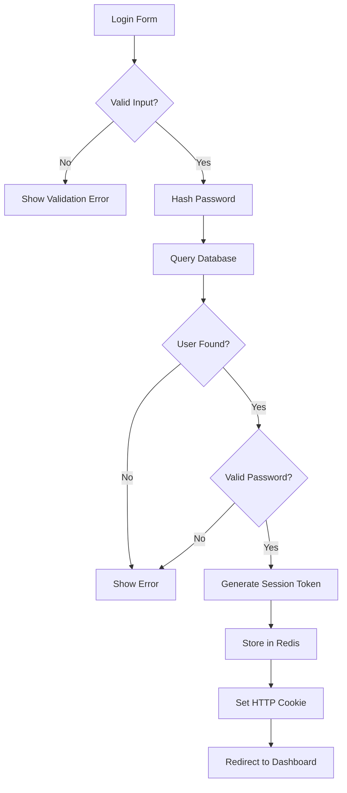
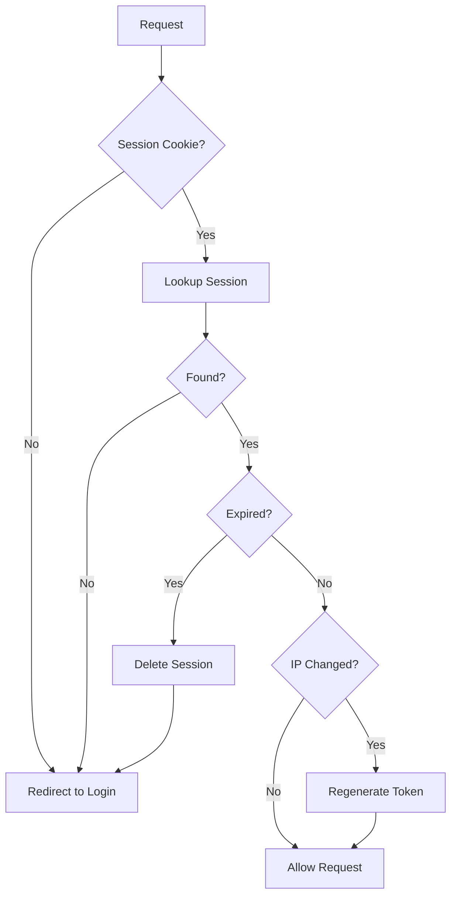
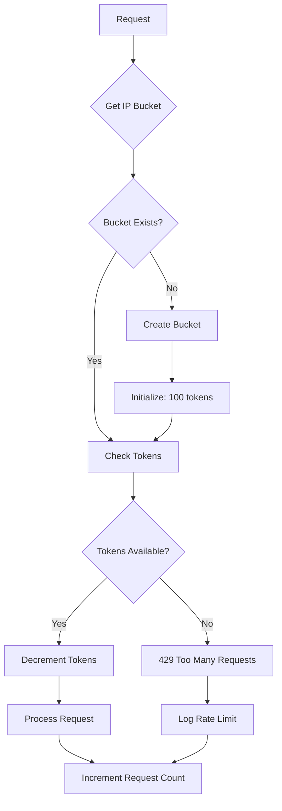
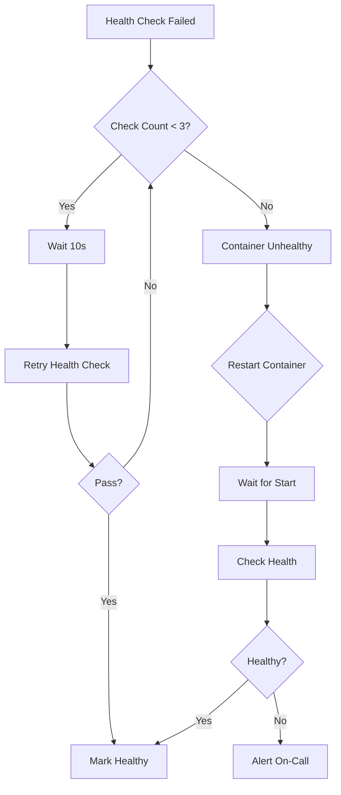

# Logic Design

## 1. Business Logic Overview

This document describes the core business logic of the BunkerWeb WAF system, including security enforcement, configuration management, and administrative workflows.

## 2. Security Enforcement Logic

### 2.1 Request Filtering Pipeline

The core security logic processes every HTTP request through multiple stages:



### 2.2 ModSecurity Rule Evaluation

Rules are evaluated in the following order:

1. **Phase 1 - Request Headers**
   - IP reputation checks
   - User-agent validation
   - Request method validation
   - URL encoding validation

2. **Phase 2 - Request Body**
   - SQL injection detection
   - XSS pattern matching
   - Command injection prevention
   - File inclusion prevention

3. **Phase 3 - Response Headers**
   - Response header validation
   - Server information leakage prevention

4. **Phase 4 - Response Body**
   - Information leakage detection
   - Error message filtering

### 2.3 Threat Scoring

Each request receives a threat score:

| Score | Action |
|-------|--------|
| 0 | Allow |
| 1-5 | Log only |
| 6-10 | Log + Warn |
| 11+ | Block (403) |

## 3. Configuration Management Logic

### 3.1 Settings Storage



### 3.2 Configuration Update Flow



## 4. Blacklist Management Logic

### 4.1 Blacklist Sources

The scheduler downloads blacklists from multiple sources:

| Source | Type | Update Frequency |
|--------|------|-----------------|
| dan.me.uk/torlist | IP (Tor exits) | Every 6 hours |
| github.com/bad-bot-blocker | User-Agent | Every 24 hours |
| Local database | Custom rules | On-demand |

### 4.2 Blacklist Processing Pipeline



### 4.3 IP Reputation Logic



## 5. User Authentication Logic

### 5.1 Login Flow



### 5.2 Session Validation



## 6. Rate Limiting Logic

### 6.1 Token Bucket Algorithm

```
requests_per_minute = 60
bucket_capacity = 100
refill_rate = 1.67/second
```

### 6.2 Rate Limit Evaluation



## 7. Health Monitoring Logic

### 7.1 Health Check Types

| Check | Interval | Timeout | Action |
|-------|----------|---------|--------|
| Docker Health | 30s | 10s | Restart container |
| API Health | 30s | 5s | Log error |
| Database | 60s | 10s | Alert |
| Redis | 60s | 5s | Alert |

### 7.2 Self-Healing Flow


