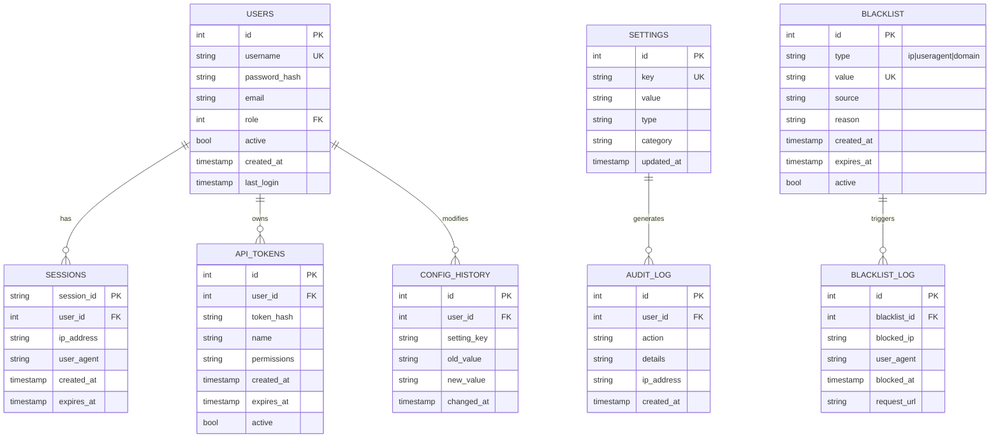
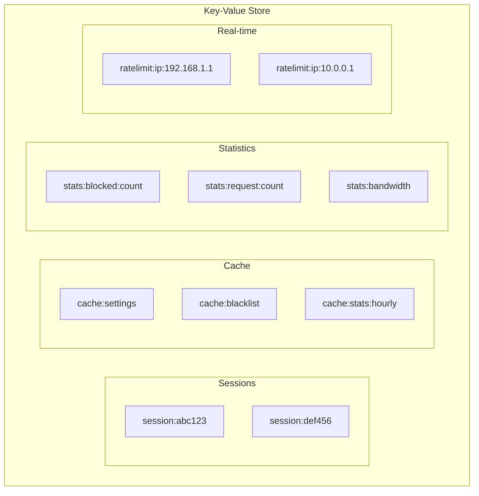
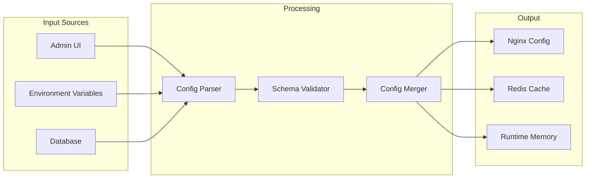

# Data Diagrams & Models

## 1. Data Storage Overview

BunkerWeb uses two primary data storage systems:
- **MariaDB**: Persistent configuration and user data
- **Redis**: Caching, sessions, and real-time statistics

## 2. Entity-Relationship Diagram



## 3. Redis Data Structures



### 3.1 Session Storage

```json
{
  "session:abc123": {
    "user_id": 1,
    "username": "admin",
    "role": "administrator",
    "ip_address": "192.168.1.137",
    "created_at": "2026-03-24T05:00:00Z",
    "expires_at": "2026-03-24T06:00:00Z"
  }
}
```

### 3.2 Rate Limiting

```json
{
  "ratelimit:ip:192.168.1.1": {
    "tokens": 95,
    "last_refill": "2026-03-24T05:30:00Z",
    "requests_today": 1234
  }
}
```

### 3.3 Statistics

```json
{
  "stats:blocked:count": "1567",
  "stats:request:count": "45832",
  "cache:blacklist": {
    "version": "42",
    "updated": "2026-03-24T05:04:00Z",
    "ip_count": 1250,
    "ua_count": 683
  }
}
```

## 4. Database Schema

### 4.1 Users Table

```sql
CREATE TABLE users (
    id INT AUTO_INCREMENT PRIMARY KEY,
    username VARCHAR(255) UNIQUE NOT NULL,
    password_hash VARCHAR(255) NOT NULL,
    email VARCHAR(255) UNIQUE NOT NULL,
    role ENUM('administrator', 'operator', 'viewer') DEFAULT 'viewer',
    active BOOLEAN DEFAULT TRUE,
    created_at TIMESTAMP DEFAULT CURRENT_TIMESTAMP,
    last_login TIMESTAMP NULL,
    totp_secret VARCHAR(64) NULL,
    INDEX idx_username (username),
    INDEX idx_email (email)
);
```

### 4.2 Settings Table

```sql
CREATE TABLE settings (
    id INT AUTO_INCREMENT PRIMARY KEY,
    setting_key VARCHAR(255) UNIQUE NOT NULL,
    setting_value TEXT,
    setting_type ENUM('string', 'integer', 'boolean', 'json') DEFAULT 'string',
    category VARCHAR(100) DEFAULT 'general',
    description TEXT,
    updated_at TIMESTAMP DEFAULT CURRENT_TIMESTAMP ON UPDATE CURRENT_TIMESTAMP,
    INDEX idx_key (setting_key),
    INDEX idx_category (category)
);
```

### 4.3 Blacklist Table

```sql
CREATE TABLE blacklist (
    id INT AUTO_INCREMENT PRIMARY KEY,
    blacklist_type ENUM('ip', 'useragent', 'domain', 'url') NOT NULL,
    value VARCHAR(512) NOT NULL,
    source VARCHAR(255),
    reason TEXT,
    is_active BOOLEAN DEFAULT TRUE,
    created_at TIMESTAMP DEFAULT CURRENT_TIMESTAMP,
    expires_at TIMESTAMP NULL,
    INDEX idx_type_value (blacklist_type, value),
    INDEX idx_active (is_active),
    INDEX idx_expires (expires_at)
);
```

### 4.4 Sessions Table

```sql
CREATE TABLE sessions (
    session_id VARCHAR(255) PRIMARY KEY,
    user_id INT NOT NULL,
    ip_address VARCHAR(45) NOT NULL,
    user_agent VARCHAR(512),
    created_at TIMESTAMP DEFAULT CURRENT_TIMESTAMP,
    expires_at TIMESTAMP NOT NULL,
    FOREIGN KEY (user_id) REFERENCES users(id) ON DELETE CASCADE,
    INDEX idx_user (user_id),
    INDEX idx_expires (expires_at)
);
```

### 4.5 Audit Log Table

```sql
CREATE TABLE audit_log (
    id INT AUTO_INCREMENT PRIMARY KEY,
    user_id INT,
    action VARCHAR(100) NOT NULL,
    details TEXT,
    ip_address VARCHAR(45),
    user_agent VARCHAR(512),
    created_at TIMESTAMP DEFAULT CURRENT_TIMESTAMP,
    FOREIGN KEY (user_id) REFERENCES users(id) ON DELETE SET NULL,
    INDEX idx_user (user_id),
    INDEX idx_action (action),
    INDEX idx_created (created_at)
);
```

## 5. Configuration Data Flow



## 6. API Request/Response Models

### 6.1 Health Check Response

```json
{
  "status": "ok",
  "version": "1.6.9",
  "uptime": 3600,
  "services": {
    "nginx": "running",
    "api": "running",
    "database": "connected",
    "redis": "connected"
  },
  "stats": {
    "requests_total": 45832,
    "blocked_total": 1567,
    "blocked_today": 45
  }
}
```

### 6.2 Configuration Push

**Request:**
```json
{
  "api_token": "xxx",
  "settings": {
    "SERVER_NAME": "example.com",
    "USE_HTTPS": "yes",
    "API_WHITELIST_IP": "10.20.30.0/24"
  },
  "blacklists": {
    "ip": ["1.2.3.4", "5.6.7.8"],
    "user_agent": ["curl", "wget"]
  }
}
```

**Response:**
```json
{
  "status": "success",
  "applied_settings": 15,
  "applied_blacklists": 2,
  "nginx_reloaded": true,
  "timestamp": "2026-03-24T05:04:42Z"
}
```

## 7. JSON Schema for Settings

```json
{
  "$schema": "http://json-schema.org/draft-07/schema#",
  "type": "object",
  "properties": {
    "SERVER_NAME": {
      "type": "string",
      "description": "Primary server name"
    },
    "API_WHITELIST_IP": {
      "type": "string",
      "pattern": "^[0-9./, ]+$",
      "description": "Comma-separated IP ranges"
    },
    "USE_HTTPS": {
      "type": "string",
      "enum": ["yes", "no"],
      "default": "no"
    },
    "DATABASE_URI": {
      "type": "string",
      "pattern": "^mysql+pymysql://"
    },
    "USE_REDIS": {
      "type": "string",
      "enum": ["yes", "no"]
    }
  }
}
```
