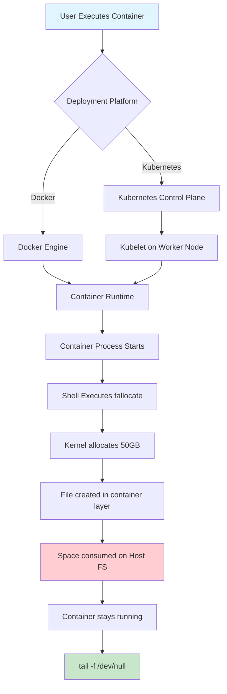
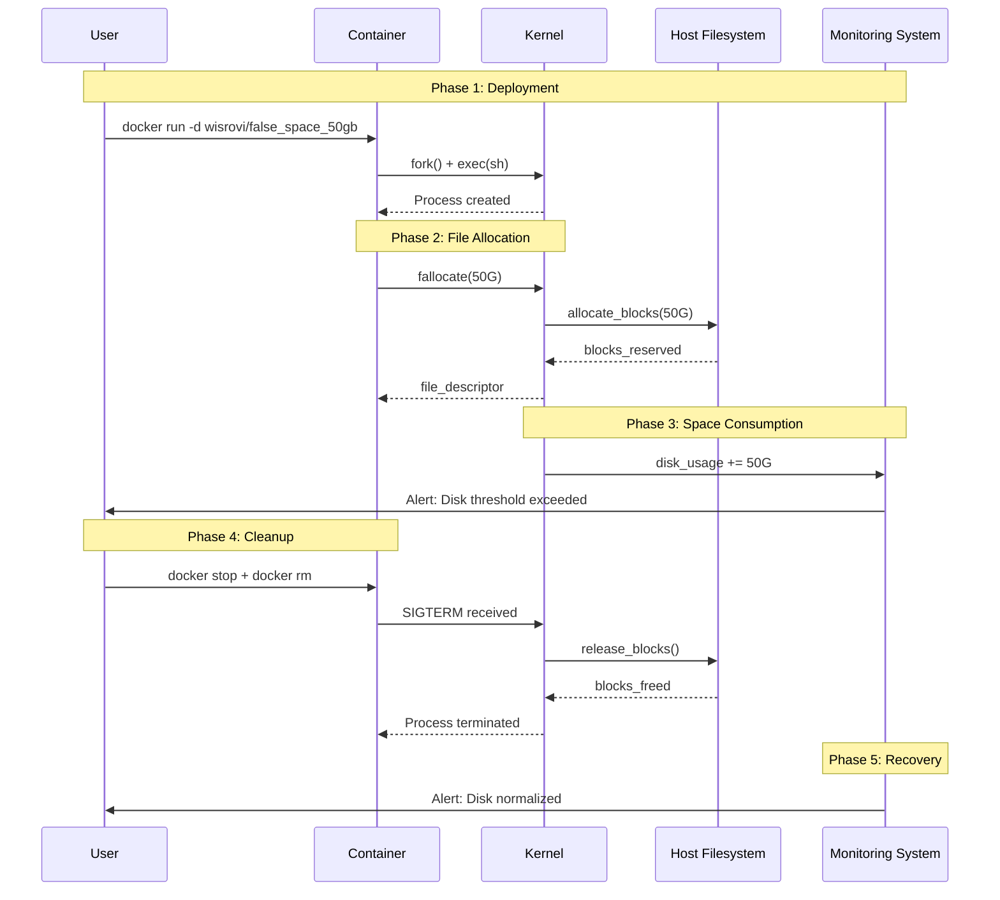
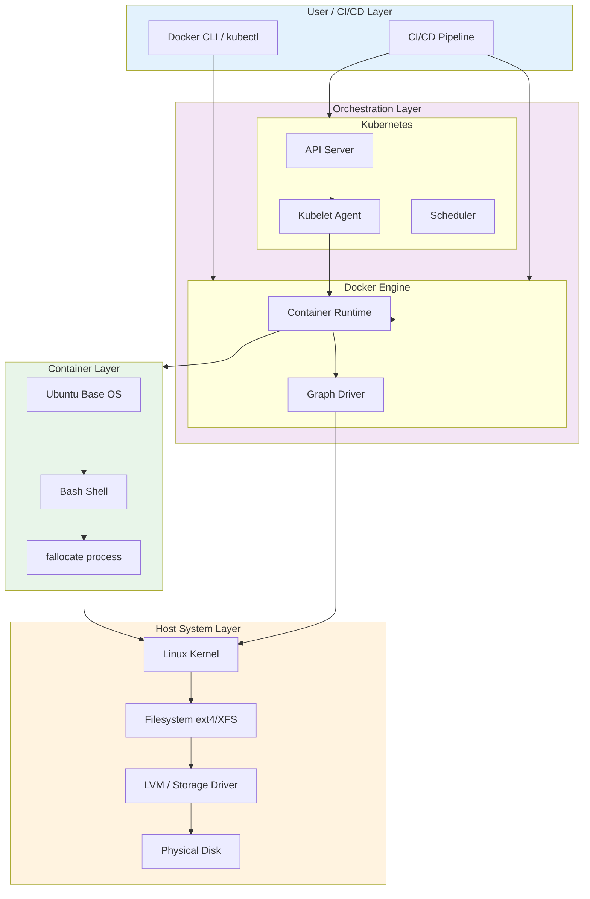

# Disk Space Filler Container

A production-ready Docker container designed for infrastructure testing, monitoring validation, and system hardening scenarios.

## Overview

This Ubuntu-based Docker container provides instant disk space allocation for testing and validation purposes. It leverages Linux's `fallocate` system call to create pre-allocated files of specified sizes without writing actual data, making it ideal for simulating disk exhaustion conditions in production-like environments.

## Key Features

- **Instant Allocation**: Uses `fallocate` for near-instantaneous file creation (orders of magnitude faster than `dd` with zero-filled blocks)
- **Production-Ready**: Built on Ubuntu LTS with minimal attack surface
- **Kubernetes-Ready**: Supports DaemonSet deployment for cluster-wide testing
- **Zero Dependencies**: Runs as a standalone container without external dependencies
- **Audit-Ready**: Includes comprehensive documentation for security compliance

---

## 1. Diagram Walkthrough

### Process Flow: Disk Space Allocation



---

## 2. System Workflow

### Sequence: End-to-End Disk Allocation



---

## 3. Architecture Components

### Static Architecture View



---

## 4. Container Lifecycle

### Build Process

The container image build process consists of the following key steps:

1. **Base Image Pull**: Ubuntu LTS base image is pulled from registry
2. **Layer Creation**: Each instruction in Dockerfile creates a new layer
3. **Cache Optimization**: Intermediate layers are cached for faster rebuilds
4. **Image Compression**: Final image is compressed and stored in local registry

### Runtime Process

From container start to operational state:

1. **Container Create**: Docker/Kubernetes creates container filesystem and namespaces
2. **Process Fork**: Shell process is spawned with fallocate command
3. **System Call**: fallocate invokes Linux kernel syscall
4. **Block Allocation**: Kernel reserves specified blocks on filesystem
5. **File Descriptor**: Returns valid file descriptor to process
6. **Process Keepalive**: `tail -f /dev/null` maintains foreground process
7. **Container Running**: Container enters running state, space remains allocated
8. **On Stop**: SIGTERM triggers cleanup, blocks released

---

## 5. File-by-File Guide

| Path | Description |
|------|-------------|
| `README.md` | Complete project documentation with architecture, usage, and troubleshooting |
| `k8s/daemonset.yaml` | Kubernetes DaemonSet manifest for cluster-wide deployment to all nodes |
| `k8s/pod.yaml` | Single Pod manifest for specific node targeting via nodeSelector |
| `docker/docker-compose.yml` | Docker Compose configuration for local testing environments |
| `docker/Dockerfile` | Container image definition for local builds |

---

## Technical Stack

| Component | Technology |
|-----------|------------|
| Base Image | Ubuntu LTS (Latest) |
| Container Runtime | Docker |
| Orchestration | Kubernetes / Docker Compose |
| Package Manager | APT |
| File Allocation | fallocate (libc) |

---

## Quick Start

### Docker Run

```bash
docker run -d wisrovi/false_space_50gb:latest \
  sh -c "fallocate -l 50G archivo_falso.img && tail -f /dev/null"
```

### Docker Compose

```yaml
version: '3.8'

services:
  disk-filler:
    image: wisrovi/false_space_50gb:latest
    command: ["sh", "-c", "fallocate -l 50G /data/filler.img && tail -f /dev/null"]
    volumes:
      - disk-space:/data

volumes:
  disk-space:
```

### Kubernetes DaemonSet

```yaml
apiVersion: apps/v1
kind: DaemonSet
metadata:
  name: disk-filler
  labels:
    app: disk-filler
spec:
  selector:
    matchLabels:
      app: disk-filler
  template:
    metadata:
      labels:
        app: disk-filler
    spec:
      containers:
        - name: disk-filler
          image: wisrovi/false_space_50gb:latest
          command: ["sh", "-c", "fallocate -l 50G /data/filler.img && tail -f /dev/null"]
          volumeMounts:
            - name: disk-space
              mountPath: /data
      volumes:
        - name: disk-space
          emptyDir: {}
      tolerations:
        - operator: Exists
```

Apply with:
```bash
kubectl apply -f k8s/daemonset.yaml
```

---

## Configuration

### Environment Variables

| Variable | Description | Default |
|----------|-------------|---------|
| `FILE_SIZE` | Size of file to allocate (e.g., 50G, 10G) | `50G` |
| `FILE_NAME` | Name of the created file | `filler.img` |
| `MOUNT_PATH` | Directory for file allocation | `/data` |

### Custom Size Examples

```bash
# 10 GB allocation
docker run -d wisrovi/false_space_50gb:latest \
  sh -c "fallocate -l 10G archivo.img && tail -f /dev/null"

# 100 GB allocation  
docker run -d wisrovi/false_space_50gb:latest \
  sh -c "fallocate -l 100G archivo.img && tail -f /dev/null"

# Custom file name and path
docker run -d wisrovi/false_space_50gb:latest \
  sh -c "fallocate -l 50G /custom/path/test.img && tail -f /dev/null"
```

---

## Usage Examples

### Use Case 1: Alert Validation

Test that your monitoring system correctly triggers alerts when disk space is low:

```bash
# Deploy container to fill disk
docker run -d wisrovi/false_space_50gb:latest \
  sh -c "fallocate -l 50G alert_test.img && tail -f /dev/null"

# Verify alert fired in Grafana/Zabbix/Netdata
# Then clean up
docker stop alert_test && docker rm alert_test
```

### Use Case 2: Application Resilience Testing

Validate database behavior under disk pressure:

```bash
# Start database container
docker run -d -v db-data:/var/lib/mysql postgres:15

# Deploy disk filler
docker run -d wisrovi/false_space_50gb:latest \
  sh -c "fallocate -l 40G db_stress.img && tail -f /dev/null"

# Observe database write failures, error handling
# Clean up
docker stop disk-filler && docker rm disk-filler
```

### Use Case 3: Kubernetes Cluster Testing

Deploy to all worker nodes simultaneously:

```bash
# Verify node distribution
kubectl get nodes -o wide

# Apply DaemonSet
kubectl apply -f k8s/daemonset.yaml

# Verify pods on each node
kubectl get pods -o wide -l app=disk-filler

# Monitor cluster-wide disk pressure
kubectl get events --field-selector involvedObject.kind=Pod

# Cleanup
kubectl delete -f k8s/daemonset.yaml
```

---

## Important Considerations

### Disk Space Impact

The allocated file directly consumes space on the host's filesystem where Docker/Kubernetes stores its data (typically `/var/lib/docker` or `/var/lib/kubelet`). Always verify available space before deployment:

```bash
df -h /var/lib/docker
```

### Filesystem Compatibility

The `fallocate` system call is supported on modern filesystems:

- Ext4
- XFS
- Btrfs
- ZFS

Unsupported filesystems or older configurations may require fallback to `dd` method.

### Permission Requirements

Some environments require elevated privileges:

```bash
# Run with extended capabilities
docker run --cap-add=SYS_RESOURCE \
  wisrovi/false_space_50gb:latest \
  sh -c "fallocate -l 50G archivo.img && tail -f /dev/null"
```

---

## Troubleshooting

### Container Exits Immediately

**Symptom**: Container stops right after starting

**Cause**: Insufficient disk space on host

**Solution**:
```bash
# Check available space
df -h

# Check container logs
docker logs <container_id>
```

### fallocate Fails with Operation Not Supported

**Symptom**: `fallocate: fallocate failed: Operation not supported`

**Cause**: Filesystem doesn't support fallocate or has restrictions

**Solution**: Use `dd` as fallback:
```bash
docker run -d wisrovi/false_space_50gb:latest \
  sh -c "dd if=/dev/zero of=archivo.img bs=1 count=0 seek=50G && tail -f /dev/null"
```

---

## Building Locally

To build the container image locally:

```bash
docker build -t wisrovi/false_space_50gb:latest .
```

---

## Monitoring Verification

Verify space allocation from within the container:

```bash
# Inside container
du -sh /
ls -lh /

# From host
docker exec <container> du -sh /data
```

---

## Cleanup

### Docker
```bash
docker stop <container> && docker rm <container>
```

### Kubernetes
```bash
kubectl delete daemonset disk-filler
# or
kubectl delete -f k8s/daemonset.yaml
```

---

## Author

**William Rodríguez** - *wisrovi*  
Technology Evangelist, AI & Cybersecurity Expert  

[](https://www.linkedin.com/in/williamrodriguez/)

---

## License

MIT License
