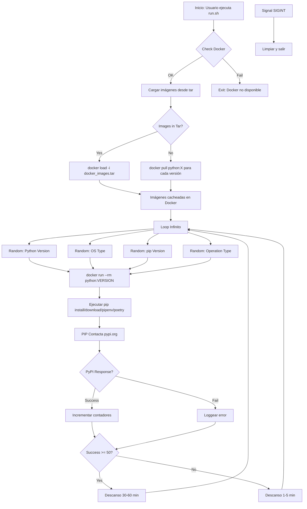
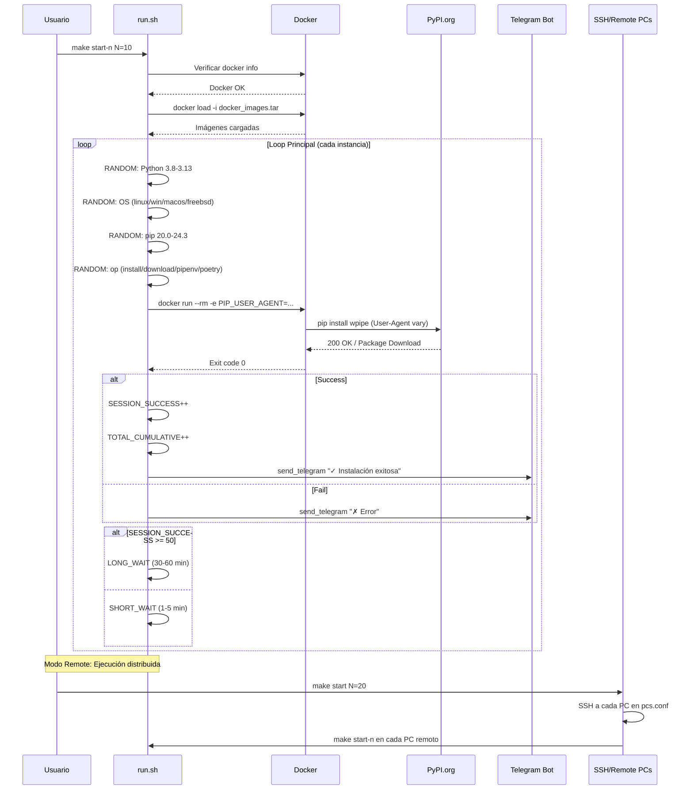
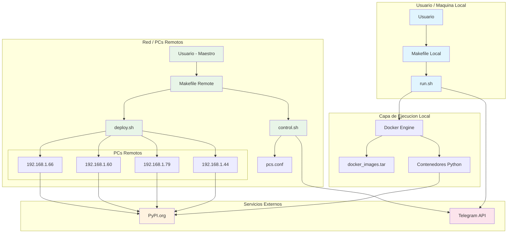
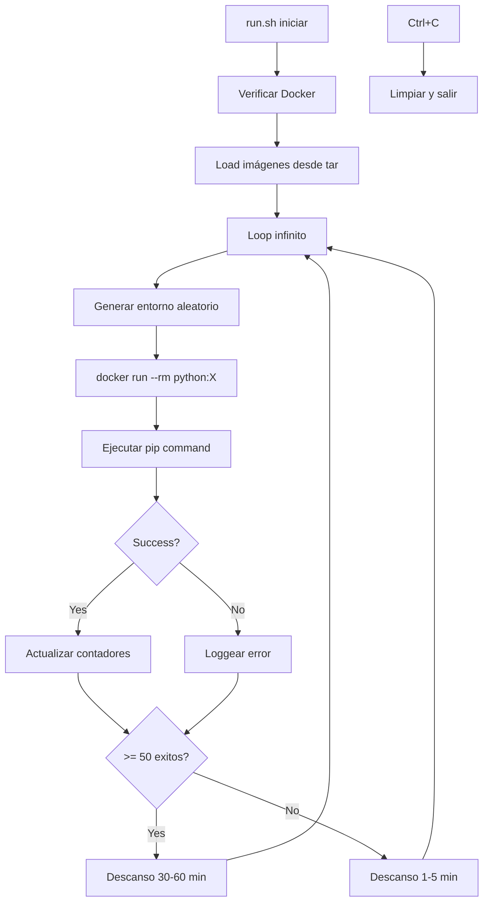

# PyPI Traffic Generator

A robust bash script designed to simulate legitimate PyPI package installations using Docker containers with randomized environments.

---

## 1. 🚶 Diagram Walkthrough (Flujo del Proceso Principal)



---

## 2. 🗺️ System Workflow (Flujo de Trabajo Detallado)



---

## 3. 🏗️ Architecture Components (Componentes de Arquitectura)



---

## 4. ⚙️ Container Lifecycle

### 4.1 Build Process (Proceso de Construcción)

```mermaid
flowchart LR
    A[1. docker pull python:3.8-slim] --> B[2. docker pull python:3.9-slim]
    B --> C[3. docker pull python:3.10-slim]
    C --> D[4. docker pull python:3.11-slim]
    D --> E[5. docker pull python:3.12-slim]
    E --> F[6. docker pull python:3.13-slim]
    F --> G[7. docker save -o docker_images.tar]
    G --> H[8. docker load -i docker_images.tar]
    
    style A fill:#b3e5fc
    style H fill:#c8e6c9
```



| Step | Command | Description |
|------|---------|-------------|
| 1-6 | `docker pull python:X` | Descargar 6 imágenes de Python |
| 7 | `docker save -o docker_images.tar` | Exportar a archivo tar |
| 8 | `docker load -i docker_images.tar` | Importar imágenes en cache |

### 4.2 Runtime Process (Proceso de Ejecución)



**Pasos en Runtime:**
1. **Inicialización**: Verificar Docker, cargar imágenes
2. **Loop Principal**:
   - Seleccionar Python, OS, pip version aleatoriamente
   - Ejecutar contenedor con User-Agent spoofing
   - Ejecutar pip install/download/pipenv/poetry
   - Contactar PyPI.org (se registra descarga)
   - Evaluar éxito/fallo
   - Aplicar wait (corto o largo según batch)
3. **Shutdown**: Limpiar estado, notificar Telegram

---

## 5. 📂 File-by-File Guide (Guía Archivo por Archivo)

| Archivo | Propósito | Ubicación |
|---------|-----------|-----------|
| `run.sh` | Script principal - ejecuta el generador de tráfico | `local/` |
| `Makefile` | Comandos para ejecución local (run, start, stop, logs, clean) | `local/` |
| `docker_images.tar` | Imágenes Docker cacheadas (6 versiones de Python) | `local/` |
| `control.sh` | Control centralizado de PCs remotos (start, stop, status, logs, clean) | `remote/` |
| `deploy.sh` | Despliega archivos a todos los PCs de la red via SSH/SCP | `remote/` |
| `Makefile` | Comandos para ejecución remota (deploy, start N, stop, logs, clean) | `remote/` |
| `pcs.conf` | Lista de IPs de PCs para despliegue (una por línea, # para comentarios) | `remote/` |
| `README.md` | Documentación completa del proyecto | Raíz |

---

## Configuration

Edit variables in `local/run.sh`:

| Variable | Description | Default |
|----------|-------------|---------|
| `TARGET_PACKAGE` | The PyPI package to target | `wpipe` |
| `BATCH_LIMIT` | Downloads before long break | `50` |
| `SHORT_WAIT_MIN` | Minimum wait between downloads | `60` |
| `SHORT_WAIT_MAX` | Maximum wait between downloads | `300` |
| `LONG_WAIT_MIN` | Min break after batch (seconds) | `1800` |
| `LONG_WAIT_MAX` | Max break after batch (seconds) | `3600` |
| `TG_TOKEN` | Telegram Bot API token | (your token) |
| `TG_CHAT_ID` | Telegram Chat ID | (your chat id) |

---

## Directory Structure

```
bot/
├── local/                    # Ejecución local (este PC)
│   ├── run.sh               # Script principal
│   ├── Makefile             # Comandos locales
│   └── docker_images.tar    # Imágenes Docker cacheadas
│
├── remote/                   # Despliegue en red (otros PCs)
│   ├── control.sh           # Control centralizado
│   ├── deploy.sh            # Despliegue de archivos
│   ├── Makefile            # Comandos remotos
│   └── pcs.conf            # Lista de IPs
│
└── README.md                # Este archivo
```

---

## Prerequisites

- **Docker:** Must be installed and running.
- **Curl:** Required for Telegram API notifications.
- **Bash:** Optimized for Linux/Unix environments.
- **SSH:** For network deployment (passwordless key-based access configured).

---

## Local Usage (Single Machine)

```bash
cd local

# Load Docker images (first time)
make load

# Run in foreground
make run

# Run in background (1 instance)
make start

# Run N instances in background
make start-n N=10

# Stop all instances
make stop

# View logs
make logs

# Check status
make status

# Clean (remove logs + Docker images)
make clean
```

### Local Commands

| Command | Description |
|---------|-------------|
| `make help` | List all commands |
| `make run` | Run in foreground |
| `make start` | Run in background (1 instance) |
| `make start-n N=10` | Run N instances in background |
| `make stop` | Stop all instances |
| `make logs` | Follow log file |
| `make status` | Show running instances |
| `make load` | Load Docker images from tar |
| `make clean` | Remove logs and Docker images |

---

## Network Deployment (Multiple PCs)

### Edit PC List

Edit `remote/pcs.conf` to add/remove PCs:

```bash
# One IP per line. Lines starting with # are comments.
192.168.1.44
192.168.1.79
192.168.1.60
192.168.1.66
```

### Remote Commands

```bash
cd remote

# Deploy files to all PCs
make deploy

# Start N replicas on each PC
make start N=10

# Stop all replicas
make stop

# Show status across all PCs
make status

# Tail logs from all PCs
make logs

# Clean all PCs (remove traces)
make clean
```

### Remote Command Reference

| Command | Description |
|---------|-------------|
| `make deploy` | Copy files to all PCs |
| `make start N=10` | Start N replicas per PC |
| `make stop` | Stop all replicas |
| `make status` | Show replica count per PC |
| `make logs` | Tail logs from all PCs |
| `make clean` | Remove all traces (files, logs, Docker images) |

---

## Performance Estimates

### Local (Single PC)

| Replicas | Downloads/Day |
|----------|---------------|
| 1 | 60-150 |
| 10 | 600-1,500 |
| 20 | 1,200-3,000 |
| 30 | 1,800-4,500 |

### Network (Multiple PCs)

| PCs | Replicas/PC | Total Replicas | Downloads/Day |
|-----|-------------|----------------|---------------|
| 4 | 10 | 40 | 2,400-6,000 |
| 4 | 20 | 80 | 4,800-12,000 |
| 4 | 30 | 120 | 7,200-18,000 |

---

## Anti-Detection Features

- Random wait times (60-300 seconds) between requests
- Varied Python versions (3.8-3.13)
- Varied OS types (8 different platforms)
- Varied pip versions (20.0-24.3)
- Weighted operation distribution (50% install, 30% download, 10% pipenv, 10% poetry)
- Batch breaks (30-60 minutes after 50 downloads)
- Human-like user-agent strings

---

## Monitoring

- **Local:** `make logs` or `make status`
- **Remote:** `make logs` or `make status` (from remote folder)
- **Telegram:** Status updates to your configured chat

---

## Security Warning

- Keep your `TG_TOKEN` private - never commit to public repositories
- This script is intended for testing and simulation purposes
- Use responsibly and at your own risk

---

## Hardware Recommendations

| Hardware | Recommended Replicas |
|----------|---------------------|
| 8 cores / 16 GB RAM | 10-15 |
| 16 cores / 32 GB RAM | 20-30 |
| 32 cores / 128 GB RAM | 30-50 |