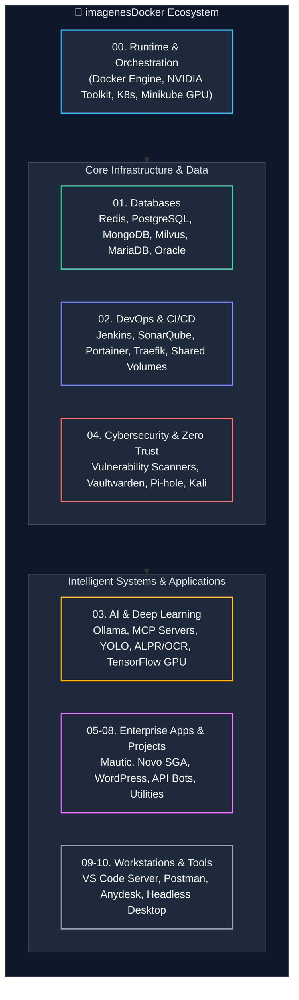

# 🐳 imagenesDocker — Enterprise Docker Architecture & Infrastructure Catalog

<p align="center">
  <a href="https://hub.docker.com/u/wisrovi"></a>
  <a href="https://wisrovi.dev"></a>
  <a href="https://linkedin.com/in/wisrovi-rodriguez"></a>
  <a href="https://orcid.org/0009-0005-0710-1861"></a>
  <a href="LICENSE"></a>
</p>

---

## 📌 Executive Overview

**`imagenesDocker`** is a curated, production-ready infrastructure repository housing multi-stage Dockerfiles, Docker Compose orchestrations, and Kubernetes manifests engineered by **William Steve Rodriguez Villamizar (Wisrovi)**. 

From low-latency database backbones and GPU-accelerated Computer Vision/AI inference containers to DevOps CI/CD pipelines, Zero Trust cybersecurity labs, and standalone microservices, this repository serves as an enterprise reference library for cloud-native and on-premise deployments.

---

## 🏗️ Architectural Topology



---

## 🗂️ Categorized Module Index

| Category | Description | Primary Stacks & Technologies |
| :--- | :--- | :--- |
| **`00 docker & nvidia install`** | Bare-metal runtime bootstrap | Docker CE, NVIDIA Container Toolkit (CUDA/GPU), K8s manifests, Minikube GPU pass-through, Kind clusters. |
| **`01 databases`** | High-performance datastores | Redis (Cluster/Standalone), MongoDB, PostgreSQL, MariaDB, MySQL, Oracle DB, Graylog, Milvus Vector DB. |
| **`02 devops`** | CI/CD automation & observability | Portainer, Jenkins CI/CD, SonarQube Code QA, SSL automated certificates, message queues, Docker Swarm patterns. |
| **`03 ArtificalInteligence`** | Accelerated MLOps & LLMs | Local LLM inference (Ollama), FastMCP agent servers, YOLO object detection, TensorFlow GPU, ALPR/OCR pipelines. |
| **`04 cibersecurity`** | Defensive security & isolation | Vulnerability scanners (Trivy/OpenVAS), Bitwarden/Vaultwarden, Pi-hole DNS sinkhole, NGINX hardened proxies, Kali Linux. |
| **`05 professional`** | Enterprise business platforms | Mautic marketing automation, Novo SGA queue management, WordPress, Java enterprise runtimes, ECM document workflows. |
| **`06 personals`** | Self-hosted personal services | Firefly III financial management & personal accounting. |
| **`07 generals`** | Cloud developer environments | Visual Studio Code Remote Server, Mealie recipe management, Speedtest trackers. |
| **`08 projects`** | Proprietary microservices | Transac-mail APIs, password vault APIs with HTTPS, GitHub PR checkers, automated PyPI release bots. |
| **`09 games`** | Sandboxed entertainment | Chess engine containers. |
| **`10 Other`** | Desktop & remote access | Sandboxed AnyDesk, headless Postman Newman runner, Slack desktop, Steam client. |

---

## ⚙️ Standard Operating Procedures (SOP)

### 1. Timezone Synchronization Across Containers
To prevent UTC skew between host logs and container execution, always standardize the host timezone mounting:

#### In `Dockerfile`:
```dockerfile
ENV TZ=Europe/Madrid
ENV DEBIAN_FRONTEND=noninteractive
RUN apt-get update && apt-get install -y tzdata && rm -rf /var/lib/apt/lists/*
```

#### In `docker-compose.yml`:
```yaml
services:
  app:
    volumes:
      - /etc/timezone:/etc/timezone:ro
      - /etc/localtime:/etc/localtime:ro
```

### 2. GPU Passthrough Pattern (NVIDIA Container Toolkit)
For AI and vision containers (`03 ArtificalInteligence/`), ensure the GPU runtime reservation is declared:

```yaml
services:
  gpu_worker:
    image: wisrovi/yolo-runtime:latest
    deploy:
      resources:
        reservations:
          devices:
            - driver: nvidia
              count: all
              capabilities: [gpu]
```

### 3. Repository Hygiene & Ignored Binaries
Heavy binary artifacts (`.tar`, `.zip`, `.sql`, `.ibd`, `.frm`, `.data`) are strictly excluded via `.gitignore` to maintain a lightweight, auditable Git history.

---

## 👤 Author & Maintainer

**William Steve Rodriguez Villamizar (Wisrovi)**  
*Principal Software Engineer & AI Solutions Architect*  
*Badajoz, Spain*

* 🌐 **Portal**: [wisrovi.dev](https://wisrovi.dev)
* 🐙 **GitHub**: [@wisrovi](https://github.com/wisrovi)
* 💼 **LinkedIn**: [wisrovi-rodriguez](https://www.linkedin.com/in/wisrovi-rodriguez/)
* 🐳 **DockerHub**: [hub.docker.com/u/wisrovi](https://hub.docker.com/u/wisrovi)
* 🆔 **ORCID**: [0009-0005-0710-1861](https://orcid.org/0009-0005-0710-1861)

---

## 📄 License

Distributed under the **MIT License**. See [`LICENSE`](LICENSE) for complete terms.
